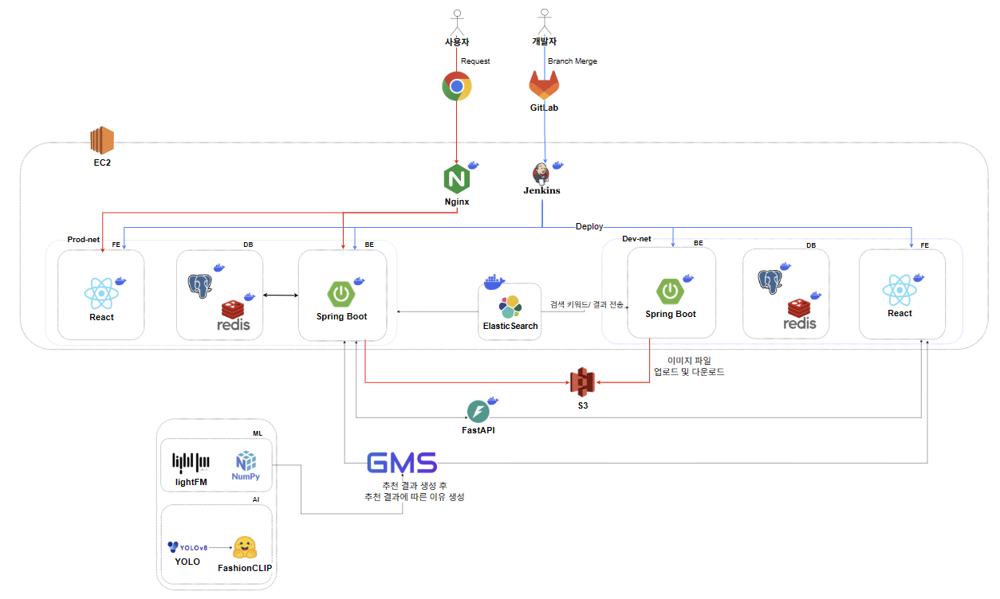
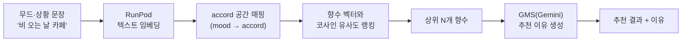
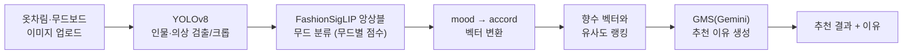
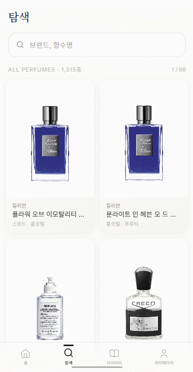
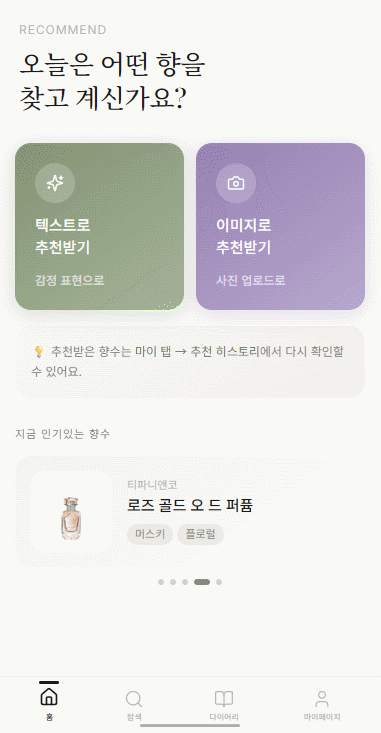
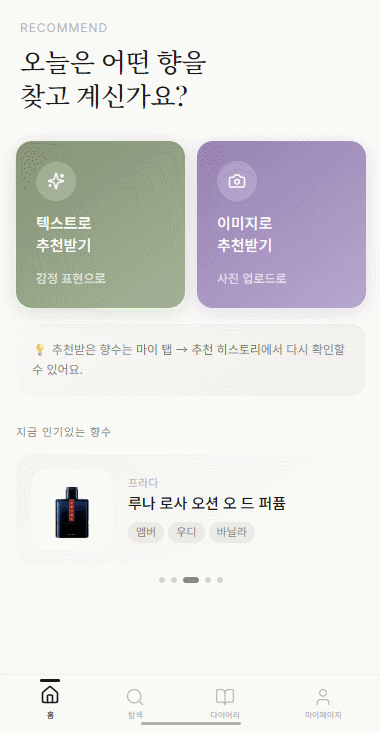
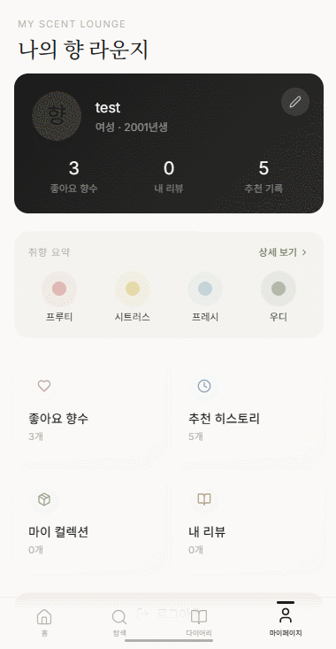

<div align="center">

# 🌸 향기록 (Scent Diary)

**맡아보지 않아도, 나에게 어울리는 향수를 찾는 AI 향수 추천 서비스**


</div>

---

## 📖 서비스 소개

향수는 직접 시향하지 않으면 고르기 어렵습니다. 온라인에서는 이름·브랜드·노트만 나열될 뿐,
"오늘 내 기분", "이 옷차림에 어울리는 향"처럼 **사람이 실제로 향수를 고르는 감각**을 도와주지 못합니다.

**향기록**은 그 간극을 메우는 향수 추천 서비스입니다.

- **검색** — 이름·브랜드·노트는 물론 초성으로도 향수를 찾습니다. (Elasticsearch)
- **텍스트 추천** — "비 오는 날 카페에서 책 읽는 느낌" 같은 문장을 향(accord) 벡터로 바꿔 추천합니다.
- **이미지 추천** — 옷차림·무드보드 사진을 올리면 그 분위기에 맞는 향수를 추천합니다. (FashionCLIP)
- **취향 분석** — 좋아요한 향수를 바탕으로 협업 필터링으로 개인화 추천합니다.
- **추천 이유** — 모든 추천 결과에 LLM이 "왜 이 향수인지"를 한국어로 설명해 줍니다.

---

## 🛠️ 기술 스택 

### Frontend


### Backend


### ML · AI


### Infra · DevOps


---

## 🏗️ 시스템 아키텍처



- **사용자 요청**은 `Nginx` 리버스 프록시를 거쳐 React` 정적 서빙과 `Spring Boot` API로 라우팅됩니다.
- **CI/CD** — 개발자가 `GitLab` 에 브랜치를 머지하면 `Jenkins` 가 빌드 후 **Dev-net / Prod-net** 컨테이너로 각각 배포합니다.
- **검색** — `Spring Boot` ↔ `Elasticsearch`. 향수 색인(이름·브랜드·노트·초성)에 검색 키워드를 질의하고 결과를 받습니다.
- **이미지 저장** — 추천용 업로드 이미지·향수 이미지는 `AWS S3` 에 저장하고 서빙합니다.
- **추천** — `Spring Boot` ↔ `FastAPI(ML)`. ML 서버는 협업 필터링과
  `RunPod` 서버리스 GPU를 조합해 추천 결과를 만듭니다.
- **추천 이유** — 추천 결과가 나오면 LLM API 가 향수별 추천 근거를 한국어로 생성합니다.
- 전체 스택은 `AWS EC2` 위에서 Docker 컨테이너로 구동됩니다. 

---

## 🧠 추천 파이프라인

향기록의 핵심은 **"자연어·이미지 → 향(accord) 벡터 → 향수 랭킹 → 추천 이유"** 로 이어지는 파이프라인입니다.

### 1. 텍스트 기반 추천



### 2. 이미지 기반 추천



### 3. 취향 기반 개인화 (협업 필터링)

- 사용자가 **좋아요** 한 향수를 시드로 협업 필터링(BM25 가중) 점수와 콘텐츠 유사도 점수를 혼합합니다.
- 보유(좋아요) 향수 수에 따라 두 점수의 가중치(`alpha`)를 동적으로 조정해, 데이터가 적은 신규 사용자도 추천이 가능합니다.

---

## ✨ 주요 기능

| | |
|---|---|
| **🔍 향수 검색** <br/> 이름·브랜드·노트·초성 검색을 Elasticsearch로 처리. 오타 보정(fuzziness)과 한글 초성 매칭 지원. <br/><br/>  | **📄 향수 상세** <br/> 브랜드·가격·노트·어코드 등 향수 정보를 한 화면에 정리해 제공. <br/><br/>  |
| **✍️ 텍스트로 추천** <br/> 기분·상황을 문장으로 입력하면 accord 벡터로 변환해 어울리는 향수를 추천하고, 이유까지 함께 제시. <br/><br/>  | **🖼️ 이미지로 추천** <br/> 옷차림·무드보드 사진을 올리면 YOLO+FashionCLIP이 무드를 분석해 향수를 추천. <br/><br/>  |
| **📊 취향 분석** <br/> 좋아요·상호작용 이력을 바탕으로 선호 어코드를 분석하고 개인화 추천을 제공. <br/><br/>  | **❤️ 좋아요 · 컬렉션** <br/> 마음에 든 향수를 저장해 나만의 컬렉션을 만들고, 추천의 근거 데이터로 활용. <br/><br/>  |

---

## 🚀 실행 방법

### 요구사항

| 도구 | 버전 |
|---|---|
| Docker / Docker Compose | 최신 |
| JDK | 21 |
| Node.js | 20+ |
| Python | 3.11 |

### 로컬 실행 (요약)

```bash
# 1. Backend 인프라 (Elasticsearch)
cd BE/fragrance
docker compose up -d

# 2. Backend (Spring Boot) — .env 설정 후
./gradlew bootRun            # 또는 IntelliJ 에서 FragranceApplication 실행

# 3. Frontend
cd FE
npm install
npm run dev

# 4. ML API
cd ML
pip install -r requirements.txt
uvicorn app.main:app --reload --port 8000
```

- 각 모듈의 환경 변수(`.env`)와 시크릿 설정, RunPod / GMS 키 발급, 배포 절차는
  **[포팅 매뉴얼](exec/)** 을 참고하세요. <!-- TODO: exec/ 에 포팅매뉴얼 문서 추가 후 링크 정확히 -->
- 초기 DB는 `exec/fragrance_db_dump_plain.sql` 로 복원합니다.

---

## 📚 문서

| 항목 | 위치 |
|---|---|
| API 명세 (Swagger UI) | 앱 구동 후 `http://<host>:8081/swagger-ui.html` |
| OpenAPI JSON | `http://<host>:8081/v3/api-docs` |
| ERD | `<!-- TODO: 링크 또는 images/erd.png -->` |
| 포팅 매뉴얼 | [`exec/`](exec/) |
| 발표 자료 | `<!-- TODO -->` |

---

## 📁 레포지토리 구조

```
scent_diary/
├── FE/                 # React 19 + TS + Vite 웹 클라이언트
├── BE/fragrance/       # Spring Boot 3.5 API 서버 (PostgreSQL · Redis · Elasticsearch)
├── ML/                 # FastAPI 추천 엔진 (협업 필터링 · mood→accord · LLM 이유 생성)
├── AI/image_recom/     # RunPod 서버리스 핸들러 (YOLOv8 + FashionCLIP/SigLIP)
├── exec/               # DB 덤프 · 포팅 매뉴얼
└── images/             # 데모 GIF · 아키텍처 다이어그램
```
